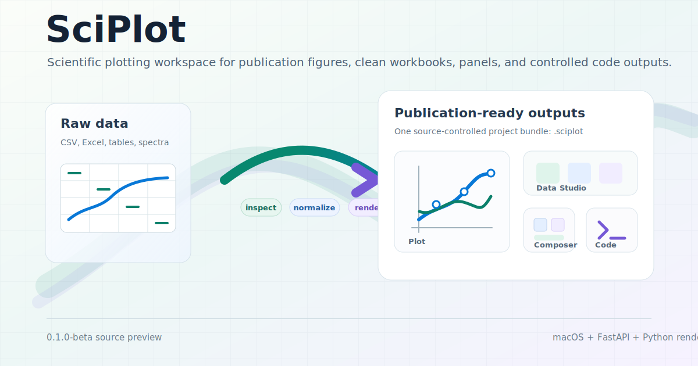

# SciPlot



SciPlot is an open-source scientific plotting workspace for researchers who need to move from raw tables to publication-ready figures without losing control of the data path. It combines a native macOS workspace with a Python rendering sidecar so figure recommendation, data cleanup, preview, export, project save/open, and code-driven analysis all share the same backend contracts.

This repository is the **0.1.0-beta source preview**. It is open for inspection, experimentation, and early feedback. It is not packaged as a distributable macOS app yet.

SciPlot is built around four focused workspaces:

- **Plot** turns source tables into contract-backed scientific figures with reproducible styling and export settings.
- **Data Studio** cleans and normalizes messy scientific tables into reusable workbooks and comparison-ready outputs.
- **Composer** assembles figures and image assets into multi-panel layouts.
- **Code Console** binds data context to controlled Python analysis runs and hands generated outputs back to the project.

## What Is Included

- A SwiftUI macOS frontend for the four-workspace desktop flow.
- A FastAPI sidecar that owns inspection, rendering, project save/open, Data Studio, Composer, and Code Console routes.
- A Python plotting/rendering core backed by a single public plot contract.
- Self-contained `.sciplot` project files for preserving durable project state and embedded sources.

The supported desktop path is:

- `app/macos`: native SwiftUI frontend
- `app/sidecar`: FastAPI sidecar
- `src/*`: plotting, rendering, Data Studio, Composer, and Code Console services

Project files use the `.sciplot` extension.

## Status

SciPlot is currently an inner-beta codebase:

- Source builds and tests are the supported validation path.
- The macOS app is launched from the repo and manages the Python sidecar from `.venv`.
- No signed, notarized, or user-friendly app bundle is published yet.
- APIs and project file internals may still change before a stable release.

## Requirements

- macOS with a recent full Xcode toolchain for the native frontend
- Python 3.14.x
- A repo-local virtual environment at `.venv`

The CI workflow uses macOS, Python `3.14.3`, Ruff, mypy, pytest, the public smoke check, and Xcode build/test.

## Quick Start

Create the Python environment:

```bash
python3 -m venv .venv
.venv/bin/python -m pip install --upgrade pip
.venv/bin/pip install -r requirements.txt
```

Run the CLI smoke path:

```bash
.venv/bin/python make_plot.py \
  --template curve \
  --input examples/curve_table.csv \
  --output-dir figures
```

Launch the macOS beta from source:

```bash
./Launch_SciPlot.command
```

The launcher builds `app/macos/SciPlot.xcodeproj` with scheme `SciPlotMac`, then opens the debug `SciPlot.app`.

## Development Checks

Run these before publishing changes:

```bash
.venv/bin/python -m ruff check .
.venv/bin/python -m mypy src/composer.py src/plot_contract.py src/data_loader.py src/tensile_replicates.py src/rendering
.venv/bin/python -m pytest tests
.venv/bin/python scripts/smoke_check.py
```

macOS build and tests:

```bash
xcodebuild \
  -project app/macos/SciPlot.xcodeproj \
  -scheme SciPlotMac \
  -destination 'platform=macOS' \
  -derivedDataPath app/macos/.derivedData \
  build

xcodebuild \
  -project app/macos/SciPlot.xcodeproj \
  -scheme SciPlotMac \
  -destination 'platform=macOS' \
  -derivedDataPath app/macos/.derivedData \
  test
```

For the full local gate:

```bash
.venv/bin/python scripts/blocking_gate.py
```

## Repository Guide

- `AGENTS.md`: contributor and maintainer boundaries for this repo.
- `src/plot_contract.json`: single source of truth for public plot templates, styles, palettes, and themes.
- `docs/product-architecture.md`: product architecture overview.
- `docs/macos-frontend-design.md`: native frontend design constraints.
- `docs/maintenance-governance.md`: maintenance and review process.

## License

SciPlot is licensed under the Apache License 2.0. See `LICENSE`.

## Security

Please do not open public issues for suspected vulnerabilities. See `SECURITY.md` for the reporting process.
